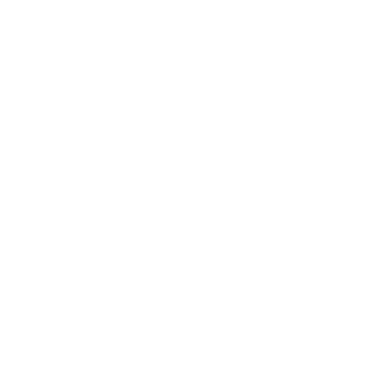
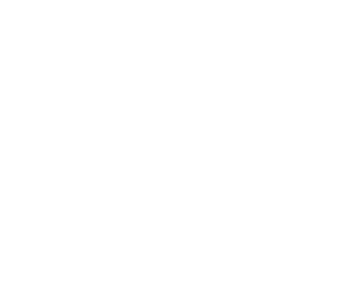
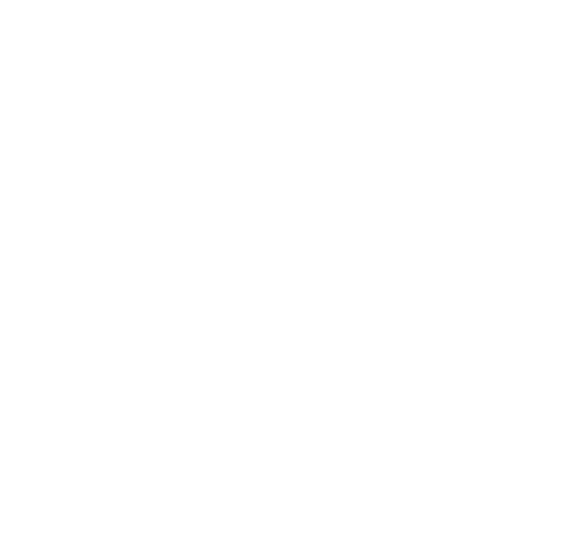

# Blood Bank Management System

A Java Swing-based desktop application for managing blood bank user accounts and donor records. Built with pure Java, no external frameworks — just JDK and Swing.

---

## Overview

This system lets users register, log in, view blood stock availability, and request blood. An admin panel provides full CRUD (Create, Read, Update, Delete) control over all user accounts. All data is stored in a plain-text file, making it lightweight and easy to inspect.

The project demonstrates core Java concepts: **Object-Oriented Programming (OOP)**, **file I/O**, **Swing GUI**, **event-driven programming**, and **MVC-like separation** (Entities for data, Frames for UI, Datas for storage).

---

## Features

| Feature | Who can use it |
|---------|---------------|
| User Registration | Anyone |
| User Login | Registered users |
| View Blood Stock | Logged-in users |
| Request Blood Bags | Logged-in users |
| Admin Login | Admin |
| View All Users (table) | Admin |
| Add / Update / Delete Users | Admin |
| Persist data to file | System |

---

## Tech Stack

- **Language:** Java (JDK 21)
- **GUI:** Java Swing (JFrame, JTable, JPanel, etc.)
- **Data Storage:** Flat file (`Datas/Data.txt`, tab-separated)
- **No external libraries** — runs with just `javac` and `java`

---

## Project Structure

```
Blood-Management-System/
├── Start.java                         # Entry point — launches Login window
├── Entities/
│   └── Account.java                   # Data model + file read/write logic
├── Frames/
│   ├── Login.java                     # User login screen
│   ├── Register.java                  # New user registration screen
│   ├── UserHome.java                  # Logged-in user dashboard (blood stock)
│   ├── AdminLogin.java                # Admin login screen
│   └── AdminHome.java                 # Admin panel (user CRUD + JTable)
├── Datas/
│   └── Data.txt                       # Tab-separated user records
├── screenshots/                       # GUI screenshots
└── .gitignore
```

---

## How to Run

```bash
# Compile all source files
javac -d out Start.java Entities/*.java Frames/*.java

# Run the application
java -cp out Start
```

Make sure you're in the project root directory so the `./Datas/Data.txt` path resolves correctly.

---

## GUI Walkthrough

### 1. Login Screen


The first window users see. Enter username and password to log in as a regular user. Two additional buttons: **New User? Register** (opens the registration form) and **Admin Login** (opens the admin login).

**Logic:** When the Login button is clicked, the app reads `Data.txt` line by line, splits each line by tab, and checks if the entered username (column 2) and password (column 3) match any record. If matched, the user is taken to the User Home screen.

---

### 2. Registration Screen



New users fill in their full name, choose a username, set a password, enter a phone number, and select their blood group from a dropdown (A+, A-, B+, B-, AB+, AB-, O+, O-).

**Logic:** Before saving, the app checks if the username already exists using `Account.usernameExists()`. If available, a new `Account` object is created and appended to `Data.txt` via `addAccount()`.

---

### 3. User Home — Blood Stock View



After login, the user sees a welcome message with their username and a table showing available blood groups and bag counts. The stock data is hardcoded for demonstration — representing real-world stock levels.

**"Request Blood" flow:** Select a blood group row, click **Request Blood**, enter the number of bags needed. A confirmation dialog is shown (simulating a request submission). The stock table does not decrement in this version — it's a demo of the request interface.

---

### 4. Admin Login


A separate login for admins. Unlike the user login, this one does **not** validate credentials against the data file — it currently accepts any non-empty input. This is intentionally simple for demonstration purposes.

---

### 5. Admin Panel — User Management



The admin panel provides full CRUD over all user accounts:

- **Table view** — All users are loaded from `Data.txt` into a `JTable` using `DefaultTableModel`.
- **Add** — Fill in the fields and click Add. The app checks for duplicate usernames before saving.
- **Update** — Select a row from the table, modify any field, and click Update. Changes are saved back to the file.
- **Delete** — Select a row and click Delete. A confirmation dialog appears before removal.
- **Clear** — Clears all input fields and deselects the table row.
- **Logout** — Returns to the Login screen.

**Logic:** When the table row selection changes, the `ListSelectionListener` fires `valueChanged()`, which populates the input fields with the selected row's data. All CRUD operations modify the `DefaultTableModel` in memory, then call `saveTableToFile()` which rewrites the entire `Data.txt` file with the updated data.

---

## OOP Concepts Demonstrated

| Concept | Where |
|--------|-------|
| **Encapsulation** | `Account` class uses `private` fields with public getters/setters |
| **Abstraction** | Data operations (read/write) are hidden inside `Account` methods |
| **Inheritance** | All frame classes extend `JFrame` |
| **Polymorphism** | `ActionListener` interface implemented by all frames, `actionPerformed()` handles multiple button sources |
| **Composition** | Frames contain child components (JPanel, JButton, JTable, etc.) |
| **Static methods** | `loadAllAccounts()`, `saveAllAccounts()`, `usernameExists()` are static utility methods on `Account` |

---

## Data Flow

```
User/Admin clicks button
        │
        ▼
actionPerformed() in Frame
        │
        ▼
Account object created / static methods called
        │
        ▼
File I/O: Data.txt read or written
        │
        ▼
UI updated / Dialog shown
```

**File format (`Data.txt`):** Tab-separated columns:
```
Name    Username    Password    Phone    BloodGroup
```

---

## Edge Cases & Validation

- **Empty fields** — All forms check for empty inputs and show a dialog message.
- **Duplicate username** — Registration and Admin Add both check `usernameExists()` before saving.
- **No row selected** — Admin Update/Delete show a message if no table row is selected.
- **Delete confirmation** — Admin Delete requires a Yes/No confirmation.
- **Empty data file** — If `Data.txt` doesn't exist, it's created automatically. If it's empty, the table simply shows no rows.

---

## Make It Your Own

Some ideas to extend this project:

- **Admin login validation** — Store admin credentials in a separate file or config.
- **Blood stock persistence** — Instead of hardcoded values, store stock in a file and let admins update it.
- **Password hashing** — Don't store plain-text passwords.
- **Search/filter** — Add a search bar to filter users in the admin table.
- **Export to PDF / CSV** — Generate reports for instructors.

---

## Author

Developed as a Java OOP project demonstrating Swing GUI, file handling, and user management.